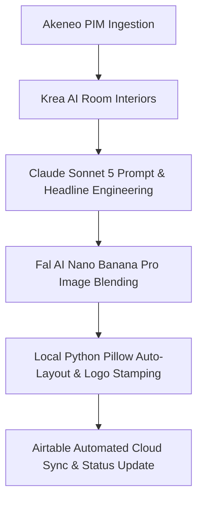

# HomeCartel Marketing AI Content Automation

This workspace contains the complete suite of automated, end-to-end AI marketing pipelines designed to produce social media content for HomeCartel lighting and furniture products.

---

## 📚 Workflow Documentation Index

| Workflow Document | Format | Description | Target Platforms |
| :--- | :--- | :--- | :--- |
| **[`CTA_STORY.md`](CTA_STORY.md)** | **9:16 Story** (`1080 x 1920`) | Generates single-product lifestyle interiors, Claude vision headlines (`Word Generated`), top-right brand logo, and right-aligned Canva CTA layouts. | Instagram / Facebook Stories |
| **[`COLLECTION_CATEGORY_STORY.md`](COLLECTION_CATEGORY_STORY.md)** | **9:16 Story** (`1080 x 1920`) | Scrapes 3 products per row, generates 16:9 interiors, and auto-assembles a 3-row grid collage with logo and Poppins Bold titles. | Instagram / Facebook Stories |
| **[`MOODBOARD_1_FEED.md`](MOODBOARD_1_FEED.md)** | **4:5 Feed** (`1080 x 1350`) | Creates 4-slide carousel posts (Blended Room, Watermarked Mark, Swatch Moodboard, Macro Texture Closeup). | Instagram Feed / Carousel |
| **[`ONE_PRODUCT_THREE_STYLES_FEED.md`](ONE_PRODUCT_THREE_STYLES_FEED.md)** | **4:5 Feed** (`1080 x 1350`) | Blends 1 product into 3 distinct room styles using Krea, Fal Claude Sonnet 5, and Fal Nano Banana Pro. | Instagram Feed / Carousel |
| **[`DAY_NIGHT_REEL.md`](DAY_NIGHT_REEL.md)** | **9:16 Reel** (`1080 x 1920`) | Produces 18-second day-to-night timelapse video reels with AI-generated jazz background music and branded outro. | Instagram Reels / TikTok / FB |
| **[`todo.md`](todo.md)** | **Task Tracker** | Active checklist of ongoing, planned, and completed marketing automation features. | Internal Development |

---

## 🏗️ Architecture & Model Stack



### Key AI Engines & Local Utilities:
- **Room Interior Generation**: Krea AI (`krea-2-medium` via Krea API).
- **Vision Analysis & Prompting**: Anthropic Claude Sonnet 5 (`anthropic/claude-sonnet-5` via Fal AI / OpenRouter).
- **Photorealistic Blending**: Fal AI Nano Banana Pro (`fal-ai/nano-banana-pro/edit`).
- **Logo & Watermark Compositing**: Local Python Pillow (`PIL`) with smart background auto-removal and sub-pixel Canva coordinate alignment (Zero API cost).
- **Video & Audio Rendering**: Fal AI Kling Video (`image-to-video`), Stable Audio 3, and local FFmpeg.

---

## 🎯 Quick Execution Commands

### 1. CTA Story Pipeline (9:16)
```bash
# Interactive menu
python generate_cta_story_pipeline.py --mode menu

# Full row-by-row pipeline
python generate_cta_story_pipeline.py

# Local conversion & watermark stamping only
python generate_cta_story_pipeline.py --mode conversion
```

### 2. Collection Category Story Pipeline (9:16)
```bash
# Interactive runner
python generate_collection_category_story_pipeline.py

# Full end-to-end pipeline
python generate_collection_category_story_pipeline.py --mode all

# Local 3-grid assembly & logo overlay only
python generate_collection_category_story_pipeline.py --mode conversion
```

### 3. Moodboard #1 Feed Carousel (4:5)
```bash
# Scrape products into Airtable
python scrape_moodboard_1_feed.py

# Run full 4-slide carousel generation
python generate_moodboard_1_feed.py
```

### 4. Day & Night Reel (9:16 Video)
```bash
# Interactive runner
python run_day_night_reel.py
```

---

## 🧪 Testing & Verification

Run the comprehensive unit test suites:
```bash
# Test CTA Story pipeline & overlay engine
python -m unittest test_generate_cta_story_pipeline.py

# Test core content automation workflows
python -m unittest test_content_automation.py
```
