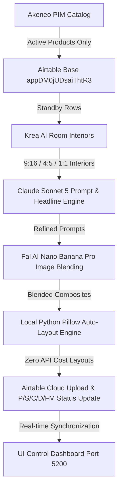

# HomeCartel Marketing AI Content Automation

Welcome to the **HomeCartel Marketing AI Content Automation** workspace. This repository contains the complete end-to-end automation suite for generating branded, high-converting social media content across **Instagram Stories (9:16)**, **Instagram Feed Carousels (4:5)**, and **Video Reels (9:16)** for HomeCartel lighting and furniture collections.

> 🤖 **Vibe Coding with AI?**  
> Read [**`AGENTS.md`**](AGENTS.md) for the master rulebook covering architecture, Airtable schema standards, Foreign Key ID conventions, 5-status badges, and local Pillow rendering rules.

---

## ⚡ Core Operational Principles (Mandatory for AI Agents & Pipelines)

1. **Always Generate Brand-New Rows (Scrape Fresh & Process End-to-End)**:
   - Every execution triggered from the Web Studio UI or CLI (without `--record-id`) MUST scrape fresh active products into a **brand-new Airtable row** and process that row end-to-end (every phase, 1 through N).
   - **NEVER** search for, iterate over, or re-run remaining or incomplete rows in the table. Old rows remain untouched unless specifically targeted by record ID.
2. **Strict Shopify "Active & Published" Filtering**:
   - Products scraped from Akeneo PIM must be strictly cross-verified against Shopify (`homecartel.net`). Any product that is Draft, Inactive, Archived, or Unlisted on Shopify is immediately skipped.
3. **Base-Wide Cross-Table Deduplication**:
   - Every product is checked against all 60+ tables in the base to guarantee zero duplicate features across Stories, Feeds, and Reels.
4. **Zero API Cost for Layouts**:
   - Typography, logos, watermarks, and layout composites are executed 100% locally via Python Pillow (`PIL`).

---

## 🖥️ HomeCartel Marketing Studio Web Dashboard

The entire automation suite is controllable through a unified full-stack web studio running on port `5200`:

```bash
# Start Web Dashboard
cd "UI Control"
python api_server.py
```
Open **`http://localhost:5200`** to access:
- **Interactive Format Tabs**: Switch between **Feed** (7 subtabs), **Story** (10 subtabs), **Reel** (7 subtabs), **Christmas Banner** ([`CHRISTMAS_BANNER.md`](docs/banners/CHRISTMAS_BANNER.md), a standalone 5th top-level Studio tab with two sub-tabs: the 21:9 Christmas banner from 5 fixtures and the 1800x600 [Sale Banner](docs/banners/SALE_BANNER.md)), and **Ad Covers** — a standalone 4th top-level Studio tab (not a sub-tab family) of per-fixture run cards, one press producing both the 1:1 cover and its 9:16 Story twin — with summed completed counts on each format and subtab.
- **Live Airtable Synchronization**: Real-time `P, S, C, D, FM` status badges on every lighting fixture card.
- **Row Inspector Modal**: Instant search, status filtering, one-click Foreign Key ID copying, and direct deep links into Airtable rows (`Open in Airtable ↗`).
- **Inline Settings & Security**: Krea moodboard and interior-prompt edits persist in `output/config_overrides.json` and `.env`; `DASHBOARD_PIN` protects edits when configured. See the [UI configuration map](docs/UI_CONTROL_CONFIG.md).
- **Interactive Execution Controls**: Trigger single-item or batch pipelines with live phase streaming logs and abort controls.

---

## 📚 Complete Pipeline Documentation Index

### 1. Instagram Stories (9:16 Vertical, `1080 x 1920 px`)

| Subtab # | Pipeline Guide | Ratio & Slides | Description | Foreign Key Prefix |
| :---: | :--- | :--- | :--- | :---: |
| **0** | [**`CTA_STORY.md`**](docs/stories/CTA_STORY.md) | 9:16 (1 slide) | Single-product lifestyle interior, Claude headline, top-right logo, and Canva CTA layout box. | `CTA-STORY` |
| **1** | [**`TIPS_AND_EDU_STORY.md`**](docs/stories/TIPS_AND_EDU_STORY.md) | 9:16 (1 slide) | YOLO product name tag plus a local-Pillow "Style Tip of the Day" layout with a Claude-written styling tip. | `TNE-STORY` |
| **2** | [**`COLLECTION_CATEGORY_STORY.md`**](docs/stories/COLLECTION_CATEGORY_STORY.md) | 9:16 (1 slide) | 3-product collage grid, Poppins Bold titles, and brand watermark overlay. | `CC-STORY` |
| **3** | [**`DAY_NIGHT_STORY.md`**](docs/stories/DAY_NIGHT_STORY.md) | 9:16 (2 slides) | Daytime photorealistic room blend and evening night lighting transformation. | `DN-STORY` |
| **4** | [**`MOODBOARD_STORY.md`**](docs/stories/MOODBOARD_STORY.md) | 9:16 (2 slides) | Product room integration paired with a branded luxury moodboard swatch card. | `MB-STORY` |
| **5** | [**`PRODUCT_CLOSEUP_SPECS_STORY.md`**](docs/stories/PRODUCT_CLOSEUP_SPECS_STORY.md) | 9:16 (1 slide) | High-detail product closeup with dimensions, material specs, and technical typography. | `PCS-STORY` |
| **6** | [**`STYLE_THIS_STORY.md`**](docs/stories/STYLE_THIS_STORY.md) | 9:16 (4 slides) | 4-slide interactive story: Cover intro + 3 styling choices with dynamic Claude color pills. | `ST-STORY` |
| **7** | [**`MYTH_FACT_STORY.md`**](docs/stories/MYTH_FACT_STORY.md) | 9:16 (4 slides) | Educational debunking story: Cover slide, Myth breakdown, Fact revelation, Outro CTA. | `MNF-STORY` |
| **8** | [**`PRODUCT_CLOSEUP_DESCRIPTION_STORY.md`**](docs/stories/PRODUCT_CLOSEUP_DESCRIPTION_STORY.md) | 9:16 (1 slide) | Lifestyle product closeup with editorial narrative description and dimensions. | `PCD-STORY` |
| **9** | [**`THIS_OR_THAT_STORY.md`**](docs/stories/THIS_OR_THAT_STORY.md) | 9:16 (1 slide) | Side-by-side or split-screen comparison card featuring two competing fixtures. | `TOT-STORY` |

---

### 2. Instagram Feed Carousels (4:5 Ratio, `1080 x 1350 px`)

| Subtab # | Pipeline Guide | Ratio & Slides | Description | Foreign Key Prefix |
| :---: | :--- | :--- | :--- | :---: |
| **0** | [**`TIPS_AND_EDU_FEED.md`**](docs/feeds/TIPS_AND_EDU_FEED.md) | 4:5 (cover + 3 slides) | Editorial cover thumbnail + 3 product slides: interior blend, tips layout, and item tagging. | `TNE-FEEDS` |
| **1** | [**`COLLECTION_CATEGORY_FEED.md`**](docs/feeds/COLLECTION_CATEGORY_FEED.md) | 4:5 (5 slides) | 5-room carousel post showcasing a full lighting collection across living, dining, and bedroom spaces. | `CC-FEEDS` |
| **2** | [**`MOODBOARD_1_FEED.md`**](docs/feeds/MOODBOARD_1_FEED.md) | 4:5 (4 slides) | 4-slide moodboard carousel: Main room blend, watermark card, swatch card, macro texture. | `MB1-FEEDS` |
| **3** | [**`MOODBOARD_2_FEED.md`**](docs/feeds/MOODBOARD_2_FEED.md) | 4:5 (2 slides) | 2-slide carousel: photorealistic room blend + editorial architectural flat-lay moodboard. | `MB2-FEEDS` |
| **4** | [**`ONE_PRODUCT_THREE_STYLES_FEED.md`**](docs/feeds/ONE_PRODUCT_THREE_STYLES_FEED.md) | 4:5 (3 slides) | 1 lighting fixture rendered into 3 contrasting interior aesthetics (e.g. Japandi, Industrial, Modern). | `OP3S-FEEDS` |
| **5** | [**`DAY_NIGHT_FEED.md`**](docs/feeds/DAY_NIGHT_FEED.md) | 4:5 (2 slides) | Day and night carousel: Natural daylight mood vs. warm evening illumination. | `DN-FEEDS` |
| **6** | [**`PRODUCT_SHOWCASE_FEED.md`**](docs/feeds/PRODUCT_SHOWCASE_FEED.md) | 4:5 (4 slides) | 3-podium group hero slide + 3 individual solo product showcase slides. | `PS-FEEDS` |

---

### Operations & Scheduling

| Guide | Description |
| :--- | :--- |
| [`docs/AUTO_POST_SCHEDULER.md`](docs/AUTO_POST_SCHEDULER.md) | The always-on Instagram auto-publish worker that posts finished content at its scheduled PHT time. |
| [`docs/CLOUDFLARE_TUNNEL_GUIDE.md`](docs/CLOUDFLARE_TUNNEL_GUIDE.md) | Free, zero-config Cloudflare Quick Tunnel setup (`launch_studio_cloudflare.py` / `.bat`) to share the live Studio with coworkers. |
| [`docs/OPERATIONS_AND_UTILITIES.md`](docs/OPERATIONS_AND_UTILITIES.md) | Airtable maintenance, item-tagging, and diagnostic scripts that aren't part of the generation pipelines above. |
| [`docs/GIT_PUSH_AND_DEPLOY.md`](docs/GIT_PUSH_AND_DEPLOY.md) | Step-by-step guide to how the AI commits, pushes to GitHub, and deploys to Railway (checks, guardrails, failure handling). |
| [`docs/memory/README.md`](docs/memory/README.md) | Incidents, decisions, and architecture notes — why things broke and why choices were made. |

---

### 3. Video Reels (9:16 Vertical Video, `1080 x 1920 px`)

| Pipeline Guide | Duration | Description | Key Tech / Models |
| :--- | :---: | :--- | :--- |
| [**`DAY_NIGHT_REEL.md`**](docs/reels/DAY_NIGHT_REEL.md) | 18s | Day-to-night timelapse video with AI jazz background audio and branded outro. | Fal Kling Video, Stable Audio, FFmpeg |
| [**`PRODUCT_CLOSEUP_REEL.md`**](docs/reels/PRODUCT_CLOSEUP_REEL.md) | ~13s | 4-product slideshow with Poppins titles and branded outro. | Local FFmpeg, Pillow, ElevenLabs |
| [**`BEFORE_AND_AFTER_REEL.md`**](docs/reels/BEFORE_AND_AFTER_REEL.md) | ~15s | Room renovation transformation reel from bare room to styled interior. | Krea, Fal Nano Banana Pro, local FFmpeg |
| [**`MOODBOARD_REEL.md`**](docs/reels/MOODBOARD_REEL.md) | 20s | 4-product moodboard video with luxury lounge background audio. | Fal Nano Banana Pro, ElevenLabs, local FFmpeg |
| [**`STYLE_REEL_SLIDESHOW.md`**](docs/reels/STYLE_REEL_SLIDESHOW.md) | 11s | 5-room whole-home lifestyle slideshow tour. | Local FFmpeg, Pillow |
| [**`ONE_PRODUCT_THREE_STYLES_REEL.md`**](docs/reels/ONE_PRODUCT_THREE_STYLES_REEL.md) | 18s | Chandelier 3-style blended-photo reel with custom holds and branded outro. | Krea, Fal Nano Banana Pro, YOLO-World, local FFmpeg |
| [**`ONE_AT_A_TIME_LIGHTS_REEL.md`**](docs/reels/ONE_AT_A_TIME_LIGHTS_REEL.md) | ~11s | Silent bedroom reel where 3 lights (table lamp, ceiling, pendant) turn on one at a time, then all together, plus branded outro. | Krea, Fal Nano Banana Pro, YOLO-World, local FFmpeg |
| [**`SKETCH_TO_REAL_REEL.md`**](docs/reels/SKETCH_TO_REAL_REEL.md) | ~11s | Hand-drawn room outline animates line by line into the photorealistic lit interior, with cover, ElevenLabs music, and branded outro (Chandelier and Pendant). `SKETCH_TO_DRAW_REEL.md` is the superseded original spec. | Krea, Fal Nano Banana Pro, YOLO-World, Fal AI ElevenLabs, local Auto Draw + FFmpeg |

---

### 4. Ad Covers (1:1 `1080 x 1080 px` + 9:16 Story `1080 x 1920 px`)

| Fixture | Pipeline Guide | Ratio | Description | Foreign Key Prefix | Studio State |
| :--- | :--- | :---: | :--- | :---: | :--- |
| **Chandelier** | [**`AD_COVER.md`**](docs/ads/AD_COVER.md) | 1:1 + 9:16 Story (2 images) | Highest-priced newest chandelier blended into a Krea 1:1 living room, locally composited with the transparent ad-cover overlay, then extended to 9:16 by Nano Banana Pro and composited with the story overlay. | `ADC-ADS-CH` | **Runnable** |
| **Floor Lamp** | [**`AD_COVER.md`**](docs/ads/AD_COVER.md) | 1:1 + 9:16 Story (2 images) | Highest-priced newest floor lamp blended into a Krea 1:1 living room, locally composited with the ad-cover overlay, then extended to 9:16 and composited with the story overlay. | `ADC-ADS-FL` | **Runnable** |
| **Table Lamp** | [**`AD_COVER.md`**](docs/ads/AD_COVER.md) | 1:1 + 9:16 Story (2 images) | Highest-priced newest table lamp blended into a Krea 1:1 bedroom/console, locally composited with the ad-cover overlay, then extended to 9:16 and composited with the story overlay. | `ADC-ADS-TL` | **Runnable** |
| **Cluster Chandelier** | [**`AD_COVER.md`**](docs/ads/AD_COVER.md) | 1:1 + 9:16 Story (2 images) | Highest-priced newest cluster chandelier blended into a high-ceiling Krea 1:1 room, locally composited, then extended to 9:16 and composited with the story overlay. | `ADC-ADS-CL` | **Runnable** |
| **Pendant Light** | [**`AD_COVER.md`**](docs/ads/AD_COVER.md) | 1:1 + 9:16 Story (2 images) | Highest-priced newest pendant light blended into a dining room Krea 1:1 interior, locally composited, then extended to 9:16 and composited with the story overlay. | `ADC-ADS-PE` | **Runnable** |
| **Wall Light** | [**`AD_COVER.md`**](docs/ads/AD_COVER.md) | 1:1 + 9:16 Story (2 images) | Highest-priced newest wall light blended into a modern living room Krea 1:1 interior, locally composited, then extended to 9:16 and composited with the story overlay. | `ADC-ADS-WL` | **Runnable** |
| **New Collection** | [**`AD_COVER.md`**](docs/ads/AD_COVER.md) | 1:1 + 9:16 Story (2 images) | Highest-priced newest chandelier blended into a Krea 1:1 living room, locally composited with the "New Collection" overlay, then extended to 9:16 and composited with the story overlay. | `ADC-ADS-NEW` | **Runnable** |
| **On Sale Designs** | [**`AD_COVER.md`**](docs/ads/AD_COVER.md) | 1:1 + 9:16 Story (2 images) | Highest-priced newest chandelier blended into a Krea 1:1 living room, locally composited with the "On Sale" overlay, then extended to 9:16 and composited with the story overlay. | `ADC-ADS-SALE` | **Runnable** |
| **On Stock Designs** | [**`AD_COVER.md`**](docs/ads/AD_COVER.md) | 1:1 + 9:16 Story (2 images) | Highest-priced newest chandelier blended into a Krea 1:1 interior, locally composited with the "On Stock" overlay, then extended to 9:16 and composited with the story overlay. | `ADC-ADS-STOCK` | **Runnable** |

---

## 🏗️ Technical Architecture & Model Stack


```mermaid
graph TD
    A[Akeneo PIM Catalog] -->|Active Products Only| B[Airtable Base appDM0jUDsaiThtR3]
    B -->|Standby Rows| C[Krea AI Room Interiors]
    C -->|9:16 / 4:5 / 1:1 Interiors| D[Claude Sonnet 5 Prompt & Headline Engine]
    D -->|Refined Prompts| E[Fal AI Nano Banana Pro Image Blending]
    E -->|Blended Composites| F[Local Python Pillow Auto-Layout Engine]
    F -->|Zero API Cost Layouts| G[Airtable Cloud Upload & P/S/C/D/FM Status Update]
    G -->|Real-time Synchronization| H[UI Control Dashboard Port 5200]
```

### Key AI Engines & Local Utilities:
- **Room Interior Generation**: Krea AI (`krea-2-medium` via Krea API).
- **Vision Analysis & Prompting**: Anthropic Claude Sonnet 5 (`anthropic/claude-sonnet-5` via Fal AI / OpenRouter).
- **Photorealistic Blending**: Fal AI Nano Banana Pro (`fal-ai/nano-banana-pro/edit`).
- **Logo & Watermark Compositing**: Local Python Pillow (`PIL`) with smart background auto-removal and sub-pixel Canva coordinate alignment (**Zero API cost**).
- **Video & Audio Rendering**: Fal AI Kling Video (`image-to-video`), Stable Audio 3, and local FFmpeg.

---

## 🎯 Quick Execution Commands

### 1. Launch Web Dashboard
```bash
cd "UI Control" && python api_server.py
```

### 2. Run CLI Pipelines
```bash
# CTA Story (9:16)
python generate_cta_story_pipeline.py --mode all

# Collection Category Story (9:16)
python generate_collection_category_story_pipeline.py --mode all

# Style This Story (9:16)
python run_style_this_story.py --category chandeliers

# Tips & Educational Feed (4:5)
python run_tips_and_edu_feed.py --target chandeliers --phase all --execute

# Collection Category Feed (4:5)
python run_collection_category_feed.py --execute

# Day & Night Feed (4:5) — thin alias into generate_day_night_feed_pipeline (no --execute)
python run_day_night_feed.py --limit 3

# Product Showcase Feed (4:5)
python generate_product_showcase_feed_pipeline.py --mode all --max-items 3

# Ad Cover (1:1 `1080 x 1080 px` + 9:16 Story `1080 x 1920 px`) — 7 phases; one run writes both
# Ad Cover Converted Image and Ad Cover Converted Image Story. Full mode list: docs/ads/AD_COVER.md §7
python generate_ad_cover_pipeline.py --fixture chandelier --mode all --max-items 1

# Banner Set — ONE run, ONE Airtable row, ALL THREE banners (Christmas 21:9 + Sale 1800x600 + third 1800x600); this is what the Studio's Banner tab runs.
# Scrapes 10 fresh products once, then makes the three banners on that row (the third: a panel in the Sale colour + a Krea Christmas bedroom).
# Docs: docs/banners/BANNER_SET.md, docs/banners/THIRD_BANNER.md
python generate_banner_set_pipeline.py

# Promo Banner (1080x1920, 9:16 "Your Story") — the main banner (local file) extended to 9:16 by Nano Banana Pro, a Claude Sonnet 5 tagline,
# and a local Pillow layout (logo, tagline, huge 10%OFF, date line). No Airtable row. Doc: docs/banners/PROMO_BANNER.md
python generate_promo_banner_pipeline.py --banner banner.jpg --discount 10 --month SEP --year 2026 --dry-run

# Christmas Banner (21:9) — 6 phases; 1 fresh item per fixture type blended into one Krea Christmas living room,
# then a Claude title/subtitle stamped locally (Poppins, soft shadow). Table tblgNk1Tp6qKUcduw. Full doc: docs/banners/CHRISTMAS_BANNER.md
python generate_christmas_banner_pipeline.py

# Sale Banner (1800x600) — 6 phases; dining room + 1 pendant (left), kitchen + 2 pendants (right), sale panel in a Claude-suggested colour
# with 10%/15% and captions (dates with the year) from the promotions calendar. Shares the Christmas banner table. Doc: docs/banners/SALE_BANNER.md
python generate_sale_banner_pipeline.py

# Auto Post Scheduler (publishes finished content to Instagram at its scheduled time)
# See docs/AUTO_POST_SCHEDULER.md for its CRON_SECRET auth and external dependency.
python run_auto_post_scheduler.py

# Share the live Studio with coworkers via a free Cloudflare Quick Tunnel
# See docs/CLOUDFLARE_TUNNEL_GUIDE.md
python launch_studio_cloudflare.py
```

### 3. Verify Live Status Counts & Database Integrity
```bash
python scratch/audit_all_feed_subtabs.py
python scratch/test_feed_apis.py

# Ad Cover: provision the table schema (idempotent), then verify one row's attachments
# and assert the 1:1 / 9:16 geometry of both converted images
python scratch/ensure_ad_cover_fields.py --table-id tblwIsDGZBPuYJV2Z
python scratch/_verify_ad_cover_row.py
python scratch/_verify_ad_cover_image.py
```
