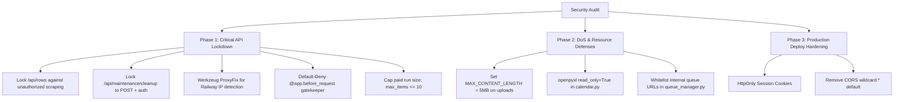

# HomeCartel Marketing Studio — Updates & Security Roadmap

> **Status Date:** October 9, 2026  
> **Environment:** React + Vite SPA (Port 5200) & Flask API Server  
> **Airtable Base:** `appDM0jUDsaiThtR3`  

---

## 1. Summary of Updates Completed Today

Today we designed, implemented, and refined the **Studio Authentication Gate & UI Cleanup** across the frontend and backend, transitioning from an unprotected dashboard to a focused, human-designed login experience.

### A. Direct-First-to-Login Flow
- **File:** `UI Control/src/app/App.tsx`
- **Behavior:**
  - Whenever an operator visits or opens the Control UI (`http://127.0.0.1:5200/`), they are **directed to the Login screen first**.
  - Purged permanent `localStorage` auto-login bypasses. The authentication state now uses **session storage**, meaning opening the site in a new tab or after closing the browser always prompts for the PIN.
  - Active work is not disrupted: refreshing the current active tab preserves the session.

### B. Minimalist, Human-Designed Login Screen
- **Files:**
  - `UI Control/src/app/components/auth/LoginScreen.tsx`
  - `UI Control/src/app/components/auth/index.ts`
  - `UI Control/src/assets/homecartel_logo.png`
- **Design Decisions:**
  - Replaced noisy "AI-generated" sci-fi tropes (glowing halos, matrix grids, decorative badges, micro-copy text, and technical telemetry footers) with a **clean, focused card**.
  - Displays the official HomeCartel logo.
  - Clear heading: **Marketing Studio** and subhead **Enter your PIN to continue**.
  - Simple PIN password input with show/hide toggle.
  - Solid, clean **Sign in** button.
  - Contextual error alert if an invalid PIN is entered.
  - Light and dark theme awareness.

### C. Top Navigation Bar Streamlining
- **File:** `UI Control/src/app/App.tsx`
- **Changes:**
  - Removed the logo icon box, `HOMECARTEL STUDIO` text, and `[PRO]` badge.
  - Maintained the clean, understated heading: **Marketing AI Content Automation**.
  - Removed the redundant **Lock** button and **Public Live** (Cloudflare tunnel) button.
  - Kept only essential controls: `ThemeToggle`, `Sync Airtable`, and `PIN Active / Set PIN`.

### D. Backend Timing-Safe PIN Check & Rate Limiting
- **File:** `UI Control/api_server.py`
- **Changes:**
  - Upgraded `/api/auth/verify` to use timing-safe comparison (`hmac.compare_digest`) via `_check_pin` from `routes/common.py`.
  - Added rate-limiting to prevent brute-force attacks: accounts are temporarily locked out after 10 failed attempts for 5 minutes.
  - Returns standard HTTP 401 on bad credentials and HTTP 429 when rate-limited.

### E. Active Studio PIN Reference
- **Environment Key:** `DASHBOARD_PIN` in `.env`
- **Configured Value:**
  ```text
  homecartel2026!1
  ```

---

## 2. Next Updates Needed (Security Audit Action Plan)

Based on the security audit report (`Security Audit_ HomeCartel Marketing Studio (marketing-automation)-20261009135023.md`), the following items should be addressed next to harden the platform:



### Phase 1: Critical API Lockdown (Recommended Next)

| Priority | Vulnerability | File | Action Required |
| :---: | :--- | :--- | :--- |
| **P0** | **`/api/rows` is open to the public** | `UI Control/routes/rows.py` | Add `if not is_authorized(request): return jsonify(...), 401`. Sanitize `status` query parameter to prevent formula injection. Cap pagination to 100 rows per request. |
| **P0** | **`/api/maintenance/cleanup` deletes files without auth** | `UI Control/api_server.py` | Remove `GET` method (enforce `POST` only). Require `is_authorized(request)`. Enforce a floor of `hours >= 6.0` so active temp files aren't deleted. |
| **P1** | **Shared proxy IP lockout on Railway** | `UI Control/api_server.py` | Add Werkzeug `ProxyFix(app.wsgi_app, x_for=1, x_proto=1)` so rate-limiting tracks the real client IP rather than the shared proxy. |
| **P1** | **Unauthenticated status & log leakage** | `UI Control/api_server.py` | Implement a central `@app.before_request` hook that blocks all `/api/*` endpoints by default, whitelisting only `/api/health`, `/api/auth/config`, and `/api/auth/verify`. |
| **P1** | **Paid generation runaway spend** | `UI Control/routes/*.py` | Enforce a strict ceiling of `max_items = min(int(items), 10)` on all direct `/run` routes. |
| **P2** | **Queue internal dispatch bypass** | `UI Control/routes/queue_manager.py` | Provide an `INTERNAL_TOKEN` header for loopback HTTP calls (`127.0.0.1`) so internal worker polling isn't blocked by the `@app.before_request` gate. |

### Phase 2: DoS & Resource Defenses

1. **Excel Upload Protection (`routes/calendar.py`)**:
   - Set `app.config['MAX_CONTENT_LENGTH'] = 5 * 1024 * 1024` (5 MB upload cap).
   - In `parse_month_slots`, use `openpyxl.load_workbook(filename, read_only=True, data_only=True)` to prevent memory ballooning from crafted spreadsheets.
2. **Queue Whitelist (`routes/queue_manager.py`)**:
   - Cap maximum queue length at 20 jobs.
   - Validate `run_endpoint` and `status_endpoint` against known pipeline URLs (`/api/cta/*`, `/api/tips-edu/*`, etc.) to prevent arbitrary loopback calls.
3. **Temp File Cleanup Guarantee**:
   - Ensure `downloaded.cleanup()` runs inside `finally:` blocks in `generate_house_tour_reel_pipeline.py` and CTA pipelines.

### Phase 3: Production & Deployment Hardening

1. **CORS Hardening**:
   - Remove wildcard `*` from `add_cors_headers` in `api_server.py`. Default to same-origin with opt-in domains via `ALLOWED_ORIGINS`.
2. **Generic Error Responses**:
   - Sanitize 500 error responses so raw internal Python exception strings (`str(error)`) are logged to disk rather than returned to client browsers.
3. **GitHub Workflow Injection Prevention**:
   - In `.github/workflows/product_closeup_reel.yml`, pass `${{ github.event.inputs.max_rows }}` through `env:` instead of directly interpolating into inline shell commands.

---

## 3. Verification & Build Commands

### Rebuilding Frontend Assets:
```powershell
cd "UI Control"
npm run build
```

### Running Backend API Server:
```powershell
python "UI Control\api_server.py"
```

### Running Test Suite:
```powershell
python -m unittest discover tests
```
*(All 457 tests passing as of October 9, 2026).*
