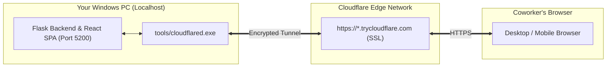

# Cloudflare Quick Tunnel Sharing Guide — HomeCartel Marketing Studio

This guide explains how to share the **HomeCartel Marketing Studio** (`http://localhost:5200`) with coworkers anywhere in the world for **100% free**, with **zero account configuration**, **no credit card**, and **no custom domain** required.

---

## 1. Quickstart (How to Share with Coworkers)

### Method A: Double-Click (Recommended for Windows)
1. In Windows File Explorer, navigate to:
   ```
   C:\Users\User\marketing-automation\
   ```
2. Double-click **`launch_studio_cloudflare.bat`**.
3. A terminal window will open, start the tunnel, and print your public HTTPS link:
   ```
   ============================================================================
     SUCCESS! YOUR HOMECARTEL STUDIO IS LIVE ON THE INTERNET
   ============================================================================

     >> Public HTTPS Link : https://xxxx-xxxx-xxxx.trycloudflare.com
        [Copied to clipboard! Ready to paste into Slack / Teams]
     >> Studio PIN        : homecartel2026!1
     >> Local Port        : http://localhost:5200

     Coworker Access:
     - Anyone with this link can browse cards, view counts & inspect rows.
     - To trigger paid AI generation runs, share the Studio PIN above.
   ```
4. Paste the link into Slack, Microsoft Teams, or WhatsApp for your coworkers.

---

### Method B: Command Line (CLI)
From any terminal in the workspace:
```bash
python launch_studio_cloudflare.py
```

Optional CLI flags:
- `--port 5200`: Specify local port (defaults to 5200).
- `--no-copy`: Do not automatically copy the URL to the clipboard.
- `--test-only`: Test tunnel connectivity and shut down automatically after 5 seconds.

---

## 2. Coworker Capabilities & Security Model

| Feature | Without PIN | With Studio PIN (`homecartel2026!1`) |
| :--- | :---: | :---: |
| **Browse all 10 Story Subtabs** | ✅ Allowed | ✅ Allowed |
| **Browse all 7 Feed Subtabs** | ✅ Allowed | ✅ Allowed |
| **View Live Status Badges (`P`, `S`, `C`, `D`, `FM`)** | ✅ Allowed | ✅ Allowed |
| **Open Row Inspector & View Airtable Records** | ✅ Allowed | ✅ Allowed |
| **Trigger Paid AI Runs (Fal AI, Claude, Krea)** | 🔒 Blocked (Prompts for PIN) | ✅ Allowed |
| **Update Krea AI Prompts or Moodboards** | 🔒 Blocked (Prompts for PIN) | ✅ Allowed |

> [!NOTE]
> This dual-tier security model ensures coworkers can audit content progress and review marketing schedules freely, without the risk of accidental paid API spending.

---

## 3. How It Works (Architecture)



1. **Self-Contained Executable**: Uses the workspace binary [`tools/cloudflared.exe`](../tools/cloudflared.exe). No admin rights or system installations needed.
2. **Dynamic Quick Tunnel**: Cloudflare establishes an encrypted outbound tunnel to Cloudflare Edge nodes, assigning a unique HTTPS URL on `trycloudflare.com`.
3. **No Port Forwarding**: Operates purely over outbound HTTPS connections (Port 443). Works behind firewalls, VPNs, and home Wi-Fi routers without router configuration.
4. **Local Execution**: All image composition (Pillow typography, layout rendering) and AI orchestration occur locally on your machine.

---

## 4. Keeping the Tunnel Active & Shutting Down

- **While coworkers are using it**: Keep the `launch_studio_cloudflare.bat` terminal window open, and ensure your computer doesn't sleep.
- **When finished**: Press **`Ctrl + C`** in the terminal window to shut down the tunnel. The public link immediately stops working.
